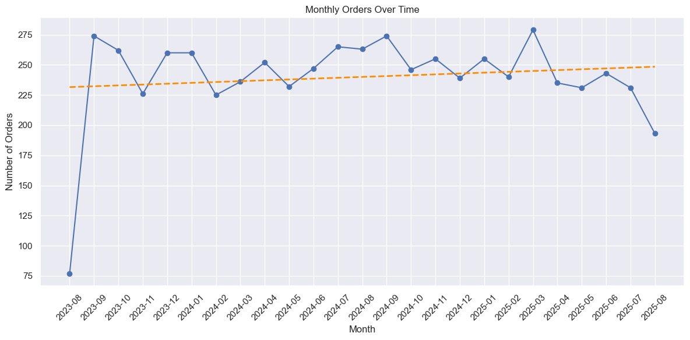
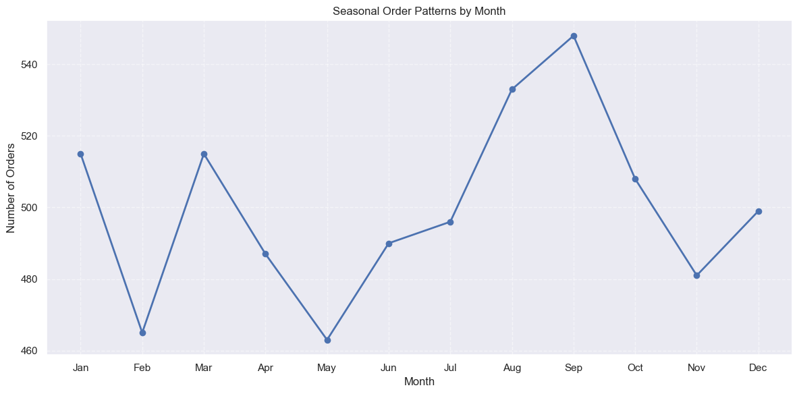
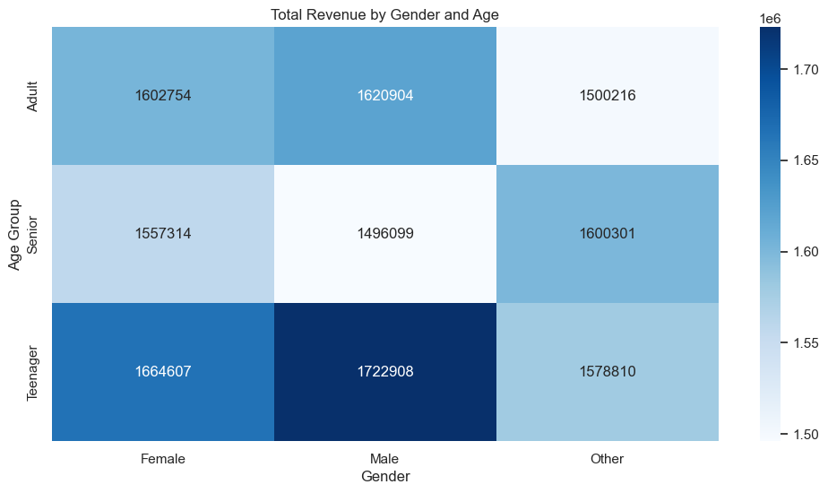
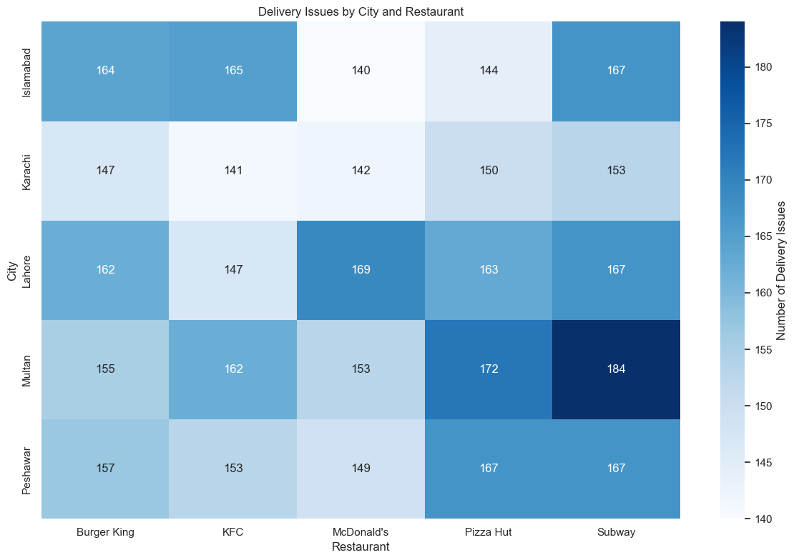
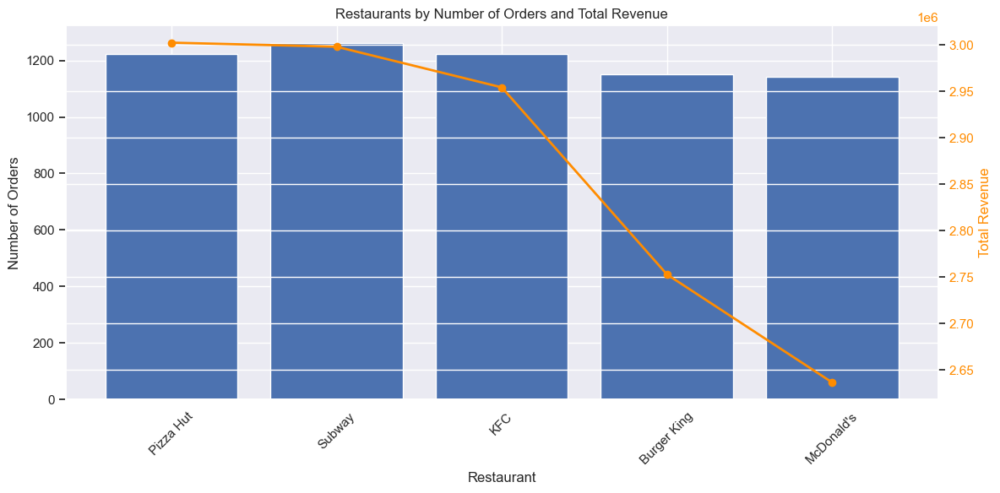

# FoodPanda Delivery Analysis
## Introduction
This case study analyzes data gathered from Foodpanda which includes comprehnsive information about Foodpanda orders, such as customer details, order status, delivery times, restaurant preferences, ratings, and payment methods. The objective is to gain a detailed understanding of Foodpanda’s customer ordering behavior, seasonal patterns, and operational performance to support insights and decision-making in food delivery services.

## Business Questions
Q1. How have Foodpanda’s customer orders changed over time on a monthly basis?
Q2. What seasonal patterns exist in Foodpanda orders?
Q3. Which gender–age group combinations contribute the most revenue?
Q4. Which cities and restaurants experience the most delivery issues?
Q5. Which restaurants generate the highest revenue, and how does that compare to their number of orders?

## Data
Data is provided by Ayesha Imran and available on Kaggle, licensed under Kaggle’s Standard Dataset License.
One CSV file is provided, containing customer orders and delivery records:

foodpanda_orders.csv – order-level data including:
- Customer ID
- Order ID and order timestamp
- Restaurant / cuisine information
- Order items and price
- Payment method
- Delivery status and delivery time
- Delay indicators
- Customer rating

## Requirements
- This project uses the following Python libraries:
- pandas – for data loading, cleaning, and manipulation
- numpy – for numerical operations
- matplotlib – for visualizations and custom plotting
- seaborn – for statistical plotting and styling
- calendar – for working with month and weekday names

## Result
### Q1. How have Foodpanda’s customer orders changed over time on a monthly basis?

A1. The plot, along with its trend line, shows the overall trajectory of order volume over time. An upward trend line indicates steady growth, while deviations from it highlight seasonal spikes, promotional impacts, or temporary slowdowns. Overall, the trend shows that orders have generally increased over the months, with occasional peaks and dips.

### Q2. What seasonal patterns exist in Foodpanda orders?

A2. The plot shows clear seasonality in monthly orders, with August and September consistently experiencing the highest volumes and February and May have the lowest order volumes. Overall, the plot highlights both predictable high-demand periods and slower months, but more data is needed to determine the specific factors affecting the number of orders.

### Q3. Which gender–age group combinations contribute the most revenue?

A3. The plot shows that the teenage age group spends the most compared to other age groups. Within this group, males spend more than females, highlighting a key high-revenue demographic.

### Q4. Which cities and restaurants experience the most delivery issues?

A4. The plot shows that delivery issues are highest in Multan, particularly for orders from Subway and Pizza Hut. This suggests operational or coordination challenges in that city and with these restaurants, though more data is needed to determine the exact causes.

### Q5. Which restaurants generate the highest revenue, and how does that compare to their number of orders?

A5. The plot shows that total orders are almost the same across all restaurants, but McDonald’s has significantly lower total revenue, while Pizza Hut and Subway have the highest. This suggests differences in average order value, with Pizza Hut and Subway generating more revenue per order compared to McDonald’s.

## Action Recommended 
1. A small increase in total orders over two years, indicating that platform-wide action is needed to boost orders. Strategies could include marketing campaigns, promotions, loyalty programs, or partnerships with high-revenue restaurants to drive more consistent growth.
2. Identify the factors affecting order volume to understand the reasons behind low and peak months. This insight can guide strategies to boost orders during slower periods and help prepare operations to handle spikes efficiently.
3. Implement targeting marketing and promotions toward teenagers, especially males, and offering menu items or combos that appeal to their preferences. Loyalty programs or app features that engage this age group can encourage repeat orders. Monitoring their spending trends will help adjust strategies over time.
4. Investigate operational issues in Multan, particularly with Subway and Pizza Hut, to identify the root causes of high delivery problems. Improvements could include optimizing courier allocation, streamlining restaurant preparation processes, or enhancing coordination between restaurants and delivery staff to reduce delays and errors.
5. Investigating why McDonald’s generates lower revenue despite similar order volumes, such as lower average order value or smaller basket sizes. Strategies could involve introducing higher-value combos, upselling or cross-selling options, or targeted promotions. For Pizza Hut and Subway, maintain or enhance their high-revenue performance through loyalty programs, premium offerings, or marketing campaigns to retain and grow their customer base.
